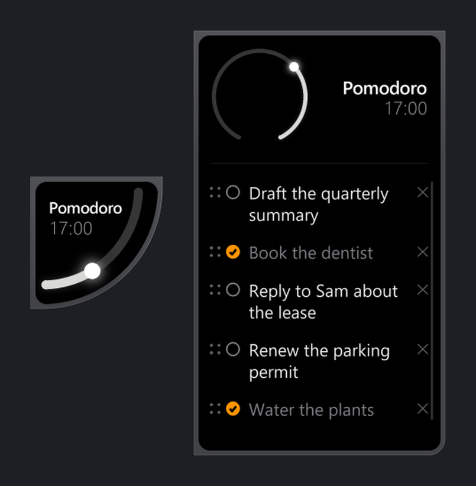
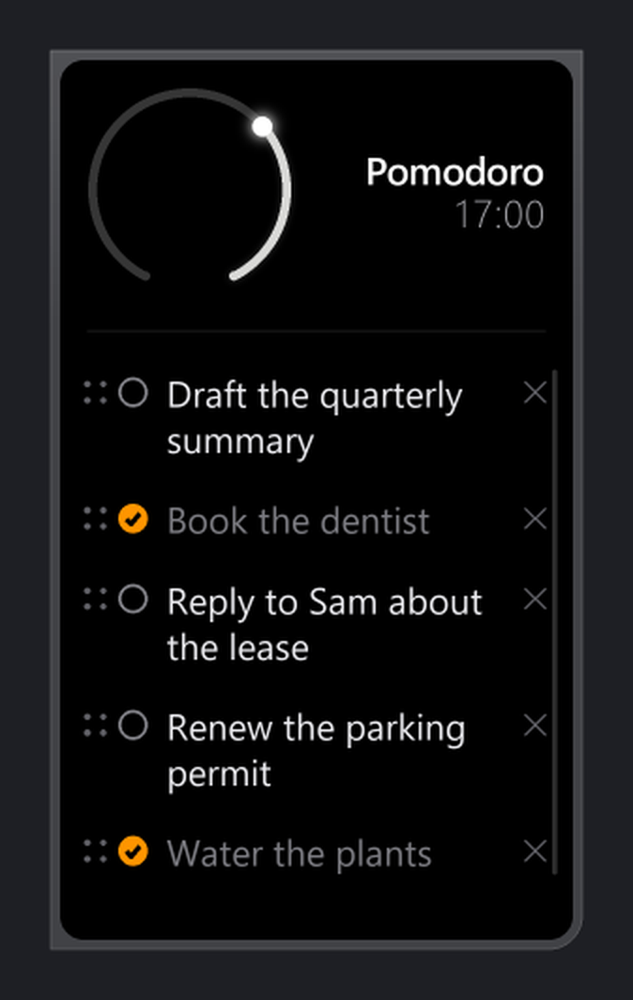
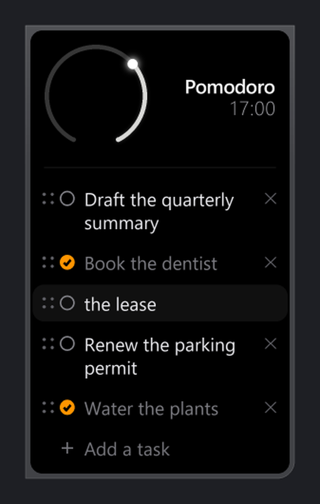
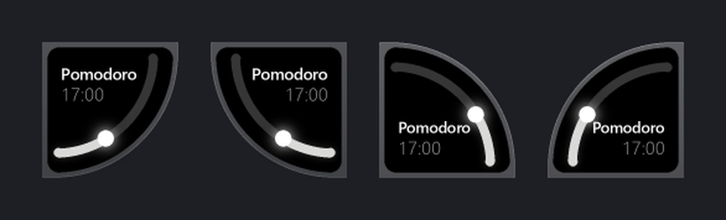

# Focus Timer

A focus timer that sits in the corner of your screen, with a to-do list folded inside it.



It docks flush into a corner as a quarter circle and stays out of the way. Double-click it and it unfolds sideways into a card with your list in it — the dial travels in from the corner and closes into a full gauge as the card opens. Double-click again and it folds back.

There is no window frame, no title bar and no taskbar button. It is drawn as one translucent shape that sits on the desktop.

## Download

**[Download the latest version](../../releases/latest)**

| | |
|---|---|
| `FocusTimer-setup.exe` | The normal way. Installs for you only, so it never asks for an administrator password. Start Menu entry, optional desktop shortcut, optional start-on-sign-in, and it uninstalls from Settings → Apps like anything else. |
| `FocusTimer-windows.zip` | Portable. Unzip, run, delete the folder when you're done. |

Windows 10 or 11. Nothing else to install — everything it needs is inside the one file.

### Windows will warn you the first time

You'll see **"Windows protected your PC"**. Click **More info**, then **Run anyway**.

That warning appears for any program that hasn't been signed with a paid certificate. It is about *who published the file*, not about what the file does — an unsigned app from a small developer gets the same warning as one from nobody at all. There's no way around it that doesn't involve buying a certificate.

## Using it



| | |
|---|---|
| Double-click the timer | Start or pause |
| Double-click again | Open the list |
| Right-click | Modes, custom time, size, chime, quit |
| Drag | Move it — let go near a corner and it snaps flush |
| Wheel over the timer | Resize |
| Wheel over the list | Scroll |

In the list:

| | |
|---|---|
| Click the circle | Tick a task off |
| Click the words | Edit them — the caret goes where you click |
| Drag a row | Reorder it |
| The × | Delete |
| Add a task | Return saves it and opens another |
| Escape | Back out of an edit, then close the list |

Clearing a task's text and pressing Return deletes it. Escape puts it back.

### The list is a real text field



Click anywhere in a task to put the caret there. Arrow keys, Home and End, Shift+arrows to select, double-click to select the whole thing so typing replaces it. A task longer than the row shows in full while you're editing it, and the list scrolls to follow the caret.

## It docks to any corner



Drag it near a corner and it snaps in, shaped to fit. Away from the corners it becomes a full circle and floats.

## Where it keeps your things

```
%APPDATA%\FocusTimer\focustimer_config.json     size, mode, position
%APPDATA%\FocusTimer\focustimer_tasks.json      your task list
```

Paste that path into any Explorer window to find them. Both are plain JSON — safe to read, back up, or copy to another machine. Uninstalling leaves them alone, so reinstalling picks up where you left off; delete the folder by hand if you want them gone.

If it ever fails to start, `focustimer_crash.log` in the same folder is the reason, written down.

## Does it phone home?

No. It makes no network connections of any kind, and it has nothing to report. Everything it knows about you is in those two files on your own machine.

## Windows only

The widget is drawn directly onto the desktop through Windows' own layered-window compositing, which has no equivalent on macOS or Linux. That's not a gap waiting to be filled — a version for either would be a rewrite of the part that makes it look like this.
